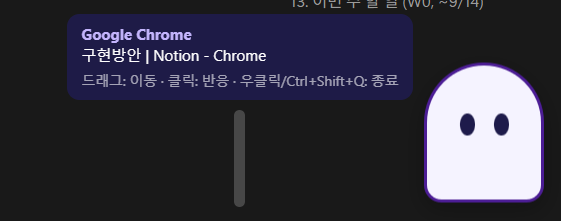
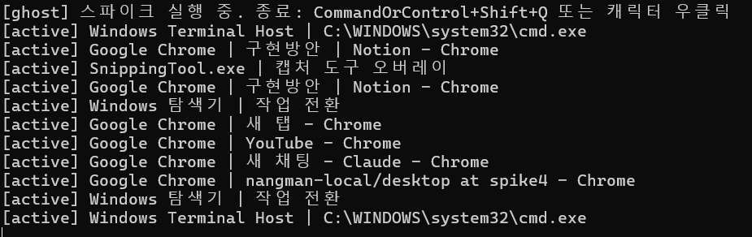

# GHOST Desktop (Electron)

[GHOST](../README.md) 모노레포의 **Windows PC 클라이언트**입니다. 현재는 기술 스파이크 단계입니다.

- 담당: 프론트
- 상태: 스파이크 완료, Windows 실기기 수동 검증 완료 (2026-09-14)
- 규칙: [`AGENTS.md`](./AGENTS.md) — 작업 전 루트 [`AGENTS.md`](../AGENTS.md)도 읽으세요

## 스파이크 목표

1. 활성 창의 앱 이름·창 제목 출력
2. 투명·항상 위 창에 임시 캐릭터 표시
3. 캐릭터 외 영역은 클릭 통과

## 실행

요구 사항: Windows 10/11 x64, **Node.js 24 이상 (LTS 권장)**. `.nvmrc`와 `package.json`의 `engines`에 명시되어 있습니다. npm 버전은 따로 고정하지 않았고, Node에 포함된 npm을 사용합니다.

```powershell
npm install
npm start
```

- 활성 창이 바뀌면 터미널에 `[active] 앱이름 | 창제목`이 출력되고, 캐릭터 옆 말풍선에도 표시됩니다.
- 종료: `Ctrl+Shift+Q` 또는 캐릭터 우클릭 (오버레이는 포커스를 받지 않기 때문에 창 닫기 버튼이 없음)
- get-windows만 따로 확인: `npm run probe` (3초 뒤 활성 창 1회 출력)

### 실행 화면

투명 오버레이 위의 임시 캐릭터와 활성 창 말풍선 (Chrome에서 Notion을 보는 중):



창을 전환할 때마다 터미널에 출력되는 활성 창 로그:



### 설치 시 주의 (npm 11+)

npm의 `allowScripts` 정책 때문에 install 스크립트가 기본으로 막힙니다.

- `electron`: 바이너리를 다운로드하는 스크립트가 필요합니다. `package.json`의 `allowScripts`에 허용해 두었습니다. 그래도 `node_modules/electron/dist/electron.exe`가 없으면 `node node_modules/electron/install.js`를 실행하세요.
- `get-windows`: Windows x64용 N-API 프리빌드(`lib/binding/napi-9-win32-unknown-x64`)가 패키지에 포함되어 있어 빌드 스크립트가 필요 없습니다. N-API라서 Electron용으로 다시 빌드하지 않아도 로드됩니다.

### macOS에서 실행 (미검증)

> 아직 Mac 실기기에서 한 번도 실행해 보지 않았습니다. 아래는 예상 절차이며, 맥 스파이크에서 확인한 뒤 확정합니다. 확인한 내용은 이 섹션과 `src/main/platform/darwin.js`에 반영해 주세요.

요구 사항: macOS (Apple Silicon 또는 Intel), Node.js 24 이상. get-windows 패키지에 macOS 프리빌드(`napi-9-darwin-unknown-arm64`, `napi-6-darwin-unknown-x64`)가 들어 있어 따로 빌드할 필요는 없을 것으로 보입니다.

```bash
npm install
npm start
```

- 실행하면 터미널에 `[ghost] darwin은 아직 실기기 검증 전입니다` 경고가 출력됩니다. 정상입니다.
- **권한:** 처음 실행하면 **화면 기록**, **손쉬운 사용** 권한을 요청합니다. `시스템 설정 → 개인정보 보호 및 보안`에서 허용한 뒤 **앱을 완전히 종료하고 다시 실행**하세요.
  - 화면 기록 권한이 없으면 창 제목이 빈 문자열로 옵니다.
  - 손쉬운 사용 권한이 없으면 브라우저 URL(`domain`)이 오지 않습니다.
  - `npm start`로 실행하면 권한 목록에 Electron이 아니라 **터미널 앱(Terminal, iTerm, VS Code 등)**이 표시될 수 있습니다. 그 경우 터미널 앱에 권한을 주세요.
- **종료:** 캐릭터 우클릭. 단축키는 `Cmd+Shift+Q`인데 macOS 로그아웃 단축키와 같아서 충돌할 수 있습니다. 확인 전에는 우클릭으로 종료하세요.
- get-windows만 따로 확인: `npm run probe`. 이때도 권한은 터미널 앱에 요청됩니다.
- 설치 파일로 배포하려면 Apple 코드서명과 공증이 필요합니다. 개발 중 `npm start` 실행에는 필요 없습니다.

맥에서 확인할 항목:

- [ ] 캐릭터·말풍선이 보이고, 캐릭터 밖을 클릭하면 뒤쪽 앱이 반응한다
- [ ] 앱 전환 시 앱 이름·제목이 출력되고, 브라우저에서는 `domain`이 채워진다
- [ ] 다른 앱을 전체화면(별도 Space)으로 전환해도 캐릭터가 보인다
- [ ] 다른 항상 위 창(PIP 등)을 띄웠다 닫은 뒤에도 캐릭터가 맨 위에 있다. 안 되면 `darwin.js`의 `reassertTopMs` 설정
- [ ] 다른 앱에서 타이핑할 때 포커스를 뺏지 않는다
- [ ] `Cmd+Shift+Q` 동작 여부

## `npm start`가 안 될 때 (Windows)

반드시 `package.json`이 있는 `desktop/` 폴더에서 실행하세요. 경로에 공백이 있으면 `cd "C:\경로\ghost\desktop"`처럼 따옴표로 감싸야 합니다.

| 증상 | 원인 | 해결 |
| --- | --- | --- |
| `npm.ps1 파일을 로드할 수 없습니다` / `running scripts is disabled on this system` | Windows PowerShell의 스크립트 실행 정책이 기본으로 막혀 있음 | `Set-ExecutionPolicy -Scope CurrentUser RemoteSigned`를 한 번 실행하거나, `npm.cmd start`로 실행 (cmd나 Git Bash에서는 `npm start` 그대로 동작) |
| `Missing script: "start"` / `ENOENT ... package.json` | 다른 폴더에서 실행함 | `dir package.json`으로 파일이 보이는 폴더인지 확인 |
| `'electron'은(는) 내부 또는 외부 명령...이 아닙니다` | `npm install`을 안 함 | `npm install` |
| `Electron failed to install correctly` / `electron.exe`가 없음 | npm 11+의 allowScripts 정책으로 Electron 바이너리 다운로드가 막힘 | `node node_modules/electron/install.js` 실행 뒤 다시 `npm start` |
| 터미널 한글이 `?ㅽ뙆?댄겕`처럼 깨짐 | 콘솔 코드페이지(CP949) 문제이며 동작에는 영향 없음 | 실행 전에 `chcp 65001` |
| 실행은 됐는데 아무것도 안 보임 | 캐릭터는 작업표시줄 아이콘 없이 **화면 오른쪽 아래 구석**에 작게 뜸 | 오른쪽 아래를 확인. 터미널에 `[active] ...`이 찍히면 정상 실행 중 |
| `[activeWindow] 결과가 비어 있습니다` 경고가 계속 나옴 | get-windows 네이티브 바인딩 로드 실패 (x64가 아닌 환경 등) | `npm run probe`로 따로 확인하고, `node_modules/get-windows/lib/binding/`에 `napi-9-win32-unknown-x64`가 있는지 확인 |
| 이미 실행 중인데 다시 실행하면 바로 꺼짐 | 단일 인스턴스 잠금 | 기존 인스턴스를 `Ctrl+Shift+Q`로 종료하거나 작업 관리자에서 `electron.exe` 종료 |

## 구조

```
src/
├── main/
│   ├── main.js          진입점: 오버레이 생성, 감지 시작, 종료 단축키
│   ├── activeWindow.js  get-windows 1초 폴링, OS 무관 형태로 정규화, 변경 시에만 콜백, 자기 프로세스 제외
│   ├── overlay.js       투명·항상 위·포커스 없음 창, 클릭 통과 토글 IPC
│   └── platform/        OS별로 달라지는 값만 모음 (index.js가 process.platform으로 선택)
│       ├── win32.js     검증 완료
│       └── darwin.js    미검증 초안 (맥 스파이크용)
├── preload/preload.cjs  contextBridge로 window.ghost API만 노출
└── renderer/
    ├── overlay.html     임시 CSS 캐릭터 + 말풍선
    └── overlay.js       캐릭터 위 판정, 드래그·클릭, 활성 창 표시
```

### OS 분리 원칙 (Windows 우선, 맥 대비)

- 공통 코드(`activeWindow.js`, `overlay.js`, 렌더러)에는 `process.platform` 분기를 두지 않습니다. OS마다 다른 값은 `platform/<os>.js`에 넣습니다.
  - `activeWindowOptions`: get-windows 옵션 (맥 권한 프롬프트 제어)
  - `overlay.alwaysOnTopLevel` / `visibleOnFullScreen` / `reassertTopMs`: 오버레이 창 레벨, 전체화면 Space 표시, topmost 재확보 주기
- 활성 창 정보는 `{ appName, title, domain, path, processId, at }`로 정규화합니다. `domain`은 브라우저 URL을 얻을 수 있는 macOS에서만 채워지고 Windows에서는 항상 `null`입니다. 서버 정책에 따라 URL 경로·쿼리스트링은 버리고 호스트만 남깁니다.
- 맥을 지원할 때는 `darwin.js`의 값을 실기기에서 검증하고 `verified: true`로 바꿉니다. 검증 전에는 실행 시 경고가 출력됩니다.

### 클릭 통과 방식

1. 오버레이는 주 모니터 작업 영역 전체를 덮고, 기본값은 `setIgnoreMouseEvents(true, { forward: true })`입니다. 클릭은 뒤쪽 앱으로 가고 mousemove만 렌더러에 전달됩니다.
2. 렌더러는 mousemove의 대상이 `#character` 안인지 검사해서, 바뀌었을 때만 `overlay:set-interactive` IPC를 보냅니다.
3. 커서가 캐릭터 위에 있을 때만 창이 마우스를 받습니다. 드래그 중에는 커서가 캐릭터 밖으로 나가도 계속 받습니다.

## 확인된 사항 / 한계

- ✅ Electron 44 + get-windows 9.3에서 활성 창 감지 동작 (Windows Terminal → 메모장 전환 감지 확인)
- ✅ 실기기에서 캐릭터·말풍선 표시 확인, Chrome/탐색기/캡처 도구/터미널 전환 감지 확인 (위 스크린샷)
- ✅ **다른 topmost 창에 가려지는 문제 수정.** Windows에서는 topmost 창끼리 나중에 올라온 창이 위에 옵니다. 그래서 캡처 도구, PIP 영상, 메신저 알림 등에 캐릭터가 가려진 뒤 복구되지 않았습니다. 이제 1초마다, 그리고 활성 창이 바뀔 때마다 `setAlwaysOnTop` + `moveTop`으로 맨 위를 다시 확보합니다 (포커스는 뺏지 않음). 가려진 뒤 최대 1초 안에 다시 올라오는 것을 확인했습니다.
- ⚠️ 그래도 가려질 수 있는 경우: 시작 메뉴·작업 전환(Alt+Tab)·알림 센터 같은 셸 UI, 독점 전체화면 게임, UAC 보안 데스크톱. OS 수준의 제약이라 앱에서 막을 수 없습니다.
- ⚠️ 창 제목이 계속 바뀌는 앱이 있습니다 (예: 터미널 제목의 스피너 `◐/◑`). 변경 이벤트가 1초마다 발생할 수 있으므로, 판단 단계에서는 앱/제목이 N초 이상 유지될 때만 평가해야 합니다 (AGENTS.md의 15~30초 원칙).
- ⚠️ **브라우저 URL은 Windows에서 제공되지 않습니다** (get-windows의 `url`은 macOS 전용). PC는 앱 이름과 창 제목만으로 판단해야 합니다.
- ⚠️ GDI 방식 스크린 캡처(`CopyFromScreen`/`BitBlt`)에는 투명 오버레이가 찍히지 않습니다. 데모를 녹화할 때는 Windows 캡처 도구나 OBS(Windows Graphics Capture)를 쓰세요.
- 알아둘 점: get-windows는 네이티브 바인딩 로드에 실패해도 에러 없이 `undefined`를 반환합니다. `activeWindow.js`에서 경고를 한 번 출력합니다.

## 수동 검증 체크리스트

- [x] 오른쪽 아래에 보라색 유령과 말풍선이 보인다
- [x] 창을 바꿀 때마다 앱 이름·제목이 출력된다 (Chrome, 탐색기, 캡처 도구, 터미널, 카카오톡 확인 / VS Code는 미확인)
- [x] 캡처 도구나 PIP 영상 같은 topmost 창을 띄웠다 닫은 뒤에도 캐릭터가 다시 맨 위에 보인다
- [x] 캐릭터를 클릭해도 `[active]`에 GHOST(electron)가 찍히지 않는다
- [x] 캐릭터 옆 빈 영역과 말풍선 위를 클릭하면 뒤쪽 앱이 반응한다
- [x] 캐릭터를 클릭하면 찌그러지는 애니메이션이 나오고, 드래그하면 이동한다
- [x] 다른 창을 최대화해도 캐릭터가 위에 있다
- [x] 캐릭터가 떠 있는 상태에서 메모장에 타이핑하면 포커스가 유지된다
- [ ] (관찰만) 전체화면 영상/게임, 배율 125%/150%, 모니터 2대, CPU 사용량

## 다음 단계

- 트레이 아이콘 (종료·일시정지)
- 감지 이벤트 정규화 → `shared/api-schema`와 맞추기
- [`shared/distract-rules.json`](../shared/distract-rules.json) 기반 로컬 규칙 판단
- Rive 캐릭터 연동 (캔버스 하나로 그려지므로 클릭 판정은 경계 박스 또는 알파 샘플링)
